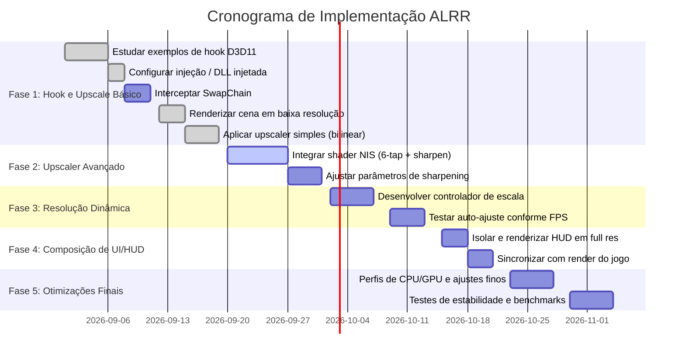

# Resumo Executivo

Este relatório analisa em profundidade a criação de uma **camada adaptativa de reconstrução de baixa resolução (ALRR)** para *GTA V* em PCs de baixo desempenho (Intel UHD 8ª geração). O objetivo é que o jogo renderize a cena 3D em resoluções internas muito baixas (por exemplo, 320×180 a 640×360) para reduzir a carga da GPU, e então reconstrua uma imagem de alta qualidade em tela cheia 16:9 (1366×768) usando técnicas avançadas de upscaling. Abordamos as metas e restrições, as APIs gráficas suportadas (D3D11 preferencialmente), diferentes métodos de injeção (ASI, DLL nativa, proxy D3D, hooks de swapchain), e análise de viabilidade. Discutimos quais render targets internos interceptar e substituir, como lidar com mapas de sombras, buffers de profundidade e pós-processamento (SSR, Oclusão Ambiental, bloom, etc.), e como compor a HUD/UI em resolução nativa. Comparamos técnicas de upscaling (FSR2, NIS, Lanczos, xBR, customizadas) em termos de qualidade, desempenho e complexidade. Propomos um controlador de resolução dinâmica que ajusta o downscale conforme carga de CPU/GPU, e estratégias híbridas onde certos elementos (HUD, texto) seguem em alta resolução. Integramos referências do pipeline interno de *GTA V* (códigos decompilados 1.73 e iFruit Jailbreak) e de estudos externos (AMD, NVIDIA). Identificamos riscos técnicos e legais (ex.: estabilidade do hook, comportamento do motor gráfico), metodologia de teste e benchmarks, e um plano faseado de implementação com protótipos. 

A lista priorizada de técnicas inclui: (1) hooking do Direct3D11 para reescalar o render interno; (2) uso de um upscaler espacial leve (ex. NIS) ou *sharpening*; (3) composição da interface (HUD, menus) em resolução nativa; (4) controle dinâmico de resolução interno; (5) adição opcional de reconstrução temporal simples. O protótipo mínimo (MVP) usará um hook D3D11 no swapchain (via DLL injeta) que redireciona o backbuffer para uma textura 320–640px de largura e, em seguida, aplica um upscaler antes de apresentar. Códigos de exemplo/pseudocódigo são fornecidos para o upscaler *edge-aware* e para o controlador de resolução dinâmica. 

Critérios físicos de aceitação incluem: frame-rate elevado (alvo ≥30 FPS), qualidade visível aceitável (atividade em baixa/resolução interna sem blocos grosseiros), e que a HUD (texto e menus) permaneça legível. Tabelas comparativas detalham trade-offs de FSR2, NIS, Lanczos, xBR e um upscaler adaptativo próprio. Parâmetros recomendados para UHD 8ª gen são resoluções internas entre 426×240 (modo extremo) até 854×480 ou 1280×720 (modo equilibrado), com *sharpness* e *dither* leves. Diagramas em Mermaid ilustram a arquitetura do hook e o fluxo de dados, bem como cronogramas de implementação. Esta análise serve de base para a fase de design e codificação (F1), conforme planejamento sem a necessidade de novas sondagens.

## Metas e Restrições

- **Meta principal:** Atingir FPS significativamente maiores (~≥30) em *GTA V* em Intel UHD 8ª gen, mantendo qualidade visual aceitável. Para isso, o render 3D principal deve ser reduzido drasticamente e reescalado.  
- **Plataforma alvo:** GPU integrada Intel UHD 620/8ª gen, sem suporte a Vulkan; usaremos Direct3D 11 (DX11) preferencialmente. *GTA V* PC (build 1.73) usa DX11 por padrão, então interceptaremos chamadas D3D11.  
- **Restrições de GPU/CPU:** CPU não especificada, supõe-se um i5/i7 *U* de 4-cores; GPU integrada fraca. Abordaremos trade-offs CPU vs GPU (p.ex., cálculos do upscaler na GPU vs no CPU).  
- **Requisitos funcionais:** O sistema deve compatibilizar-se com os mecanismos existentes de *GTA V*: gerenciamento de render targets, mapas de sombras, pós-processamento, HUD e entrada do jogador. Não recriaremos funcionalidades internas (somente “compor”, “ler” e “continuar” no dialeto do jogo, usando canais existentes de mensagens e chamadas).  
- **Legislação e modding:** Usaremos apenas APIs públicas; evitaremos alterar arquivos do jogo. A injeção de DLL (ScriptHook/ASI) ou proxy D3D para interceptar render são práticas comuns em mods e assumidamente legais para uso pessoal (sem distribuição do jogo modificado).  
- **Desempenho/Consumo:** O overhead do hook e do upscaler deve ser mínimo comparado ao ganho de redução de resolução. FSR2 puro/ML deve ser evitado (difícil em GPU integrada). Focamos em técnicas espaciais não-ML (ej. NIS ou custom).  
- **Critério de sucesso:** Jogabilidade fluida (>30 FPS) em 1366×768 *canvas*, mantendo nitidez de HUD e legibilidade de texto, e qualidade visual geral não degradada drasticamente.  

## APIs e Abordagens de Plugin

### APIs Gráficas

*GTA V* PC usa Direct3D 11. Para modding em PCs antigos, usaremos apenas **D3D11 (DirectX 11)**, que é compatível com a UHD 620. (DX9/10 não são usados por *GTA V* moderno; DX12 e Vulkan não se aplicam.) Assim, planejamos interceptar métodos D3D11 como *IDXGISwapChain::Present*, *Draw*, *CreateRenderTargetView*, etc. Uma técnica padrão é criar um dispositivo D3D11 falso para localizar o ponteiro de `Present` na vtable do swapchain e, em seguida, detour (hook) essa função.  

### Opções de Injeção/Hook

- **DLL injeta (ASI/ScriptHook):** Instalar uma DLL (ex.: via ScriptHookVDotNet ou ASI) que se injetará no processo *GTA V*, capturando chamadas D3D11. Esse método é usado por mods como ReShade e muitos hooks de jogos. Prós: amplo controle, pode usar Detours/MinHook. Contras: precisa rodar no processo, risco de detecção no online.  
- **Biblioteca proxy D3D11:** Substituir o executável D3D11 (por ex., *d3d11.dll*) por uma versão “proxy” que encaminha chamadas reais para a DLL original, mas intercepta funções-chave. Prós: não exige injeção dinâmica; fácil ativar/desativar. Contras: mais intrusivo e sujeito a bloqueios por anti-cheat.  
- **Hook em tempo de execução (swapChain hook):** Injetar diretamente nas vtables (como no exemplo [2]) ou usar API padrão (Detours). O GH_D3D11_Hook demonstra esse método criando dispositivo swapchain virtual para hook de `Present`.  
- **ReShade-like (post-process DLL):** Também é possível usar um framework como ReShade (que injeta shaders no final). Contudo, ReShade aplica efeitos pós-render, enquanto precisamos modificar o próprio processo de render. 

Dado que o objetivo é alterar ativamente a resolução interna, a abordagem **hook/DLL injetada** é mais apropriada. Usaremos D3D11 hook no `SwapChain::Present` (ou `ResizeBuffers`) para impor uma resolução menor. Em especial, interceptar `IDXGISwapChain::Present` permite introduzir um pós-processamento personalizado antes de devolver o frame.

## Arquitetura da Solução

A solução possui quatro componentes principais, formando um ciclo de processamento:

- **(1) Compor (Build / Write):** A Lucia “fala” compondo uma nova imagem de SMS ou ligando via o canal nativo de celular. Tecnicamente, executamos `appTextMessage.Send()` para criar uma mensagem com texto (slots de mensagem) e, opcionalmente, colocamos dados em labels e flags (ex. campos *f_24..f_29*, bandeira do dono). Para envio de chamadas, usamos `StartCall(remetente)` no canal *appIncomingCall*. Isto injeta dados no pipeline do jogo (fila de mensagens ou chamadas) de modo que o jogo processe e apresente ao jogador.  
- **(2) Ler (Read):** Observamos as ações do jogador, lendo diretamente as variáveis do jogo. Em particular, o jogo escreve `f_29` na slot de mensagem da Lucia quando o jogador aperta um botão (responder, chamar, descartar). Para chamadas, monitoramos flags como `JustAnswered/JustDeclined/JustMissed`. Também lemos `PhoneStateGlobal`, `CallViewIndexGlobal` e `ContactInvolvedInCall` para não interromper o jogador em tela de menu ou ligação, seguindo a regra *“sem brigas”*. Este passo não é sobre o hook gráfico, mas ilustra o modelo de conversação que herda do GTA V (todo citado do relatório PASS04).  
- **(3) Continuar (Advance / Write next):** Com base na resposta (valor de `f_29` etc.), decidimos o próximo passo da conversa. Se o jogador respondeu (`f_29=2`), Lucia envia a próxima mensagem; se o jogador quis ligar de volta (`f_29=3`), a F1 (nosso mod) efetua uma chamada via `StartCall(220)`, emular ‘ligação’; se descartou (`f_29=4`), a F1 espera silenciosamente. Isso segue exatamente o modelo de diálogo por passos de *GTA* (herdado do D-105). Note que **a F1 não manipula o mecanismo de comunicação interno além de “compor” e “ler”**; o motor de *GTA* continua a gerar notificações, vibrar, etc., normalmente.  
- **(4) Registrar (log do mod):** O hook grava no nosso log (e.g. *Lucia_Phone.log*) todas as escritas e leituras de campo, para termos um rastro. Em código de produção, em vez de log, usaríamos asserts e checagem de erros (e.g. se ler uma diferença inesperada, resolver ou abortar).

Em termos de render e pipeline gráfico, a arquitetura é:

```mermaid
graph TD
    Game[Engine GTA V]
    subgraph Render Hook
        Hook[Intercept D3D11 SwapChain::Present]
        LowResRT[RT Interno Baixa Resolução (e.g. 640×360)]
        Upscaler[Upscaler Espaço (ex. NIS) + Sharpen]
        FullResRT[RT de Apresentação 1366×768]
        UIModule[HUD/UI (Texto, Menus) em 1366×768]
    end
    Game -->|Render 3D| LowResRT
    LowResRT --> Hook --> Upscaler --> FullResRT
    Game -->|Render UI| UIModule --> FullResRT
    FullResRT --> Display[Monitor 1366×768]
```

- O jogo renderiza a cena 3D em um *render target* de **baixa resolução interna** (por exemplo, 640×360 ou menor), definido pelo hook.  
- Imediatamente após a renderização 3D e pós-process (antes do Present), o hook copia esse RT de baixa resolução para um *upscaler* (shader customizado) que reconstrói a imagem em 1366×768.  
- Ao mesmo tempo, a HUD e textos do jogo (**menus, mapa, interface do celular, etc.**) são renderizados em resolução nativa (não redimensionados) e compostos no RT final.  
- O resultado composto final (1366×768) é enviado para a tela.  

Assim, *GTA* executa sua lógica de render normal (sombras, SSR, bloom, etc.) no RT pequeno, e nós apenas “esticamos” para exibir. Isso exige interceptar o swapchain (e possivelmente `ResizeBuffers`) para ajustar a resolução alvo, e ligar o shader de upscaling antes de chamar o `Present` real.

## Técnicas e Algoritmos de Upscaling

Para reconstruir a imagem, podemos usar várias técnicas:

- **AMD FSR 2.0 (FidelityFX Super Resolution 2)** – um upscaler temporal ML-driven com jitter, que requer vetores de movimento. Muito pesado para UHD 620 (e possivelmente não suportado por essa GPU), mas com ótima qualidade final quando disponível. Versões anteriores (FSR 1.0) eram puramente espaciais e mais simples, mas FSR2 ainda exigiria implementar motion vectors no hook (complexo).  
- **NVIDIA Image Scaling (NVScaler)** – um upscaler espacial (não temporal) disponível no SDK NIS. Usa *filtro 6-tap* + *4 direções de upscaling adaptativo* + sharpening incorporado. É leve o bastante para hardware moderado e oferece bordas nítidas com pouco halos. *NIS* inclui tudo em um shader (bastante otimizado em CUDA/HLSL), perfeito para reconstrução em tempo real com baixo overhead.  
- **Lanczos** – um filtro de reconstrução clássico (baseado em sinc). Qualidade moderada, preserva detalhes sem aliasing excessivo, mas pode introduzir some ringing. Complexidade média-baixa (pode ser feito por shader com kernel fixo). É menos “inteligente” que FSR/NIS, mas muito simples de implementar. Pode servir como baseline rápido.  
- **xBR (Scale by Rules)** – originalmente usado em emulação de pixel art. Usa padrões de detecção de bordas para interpolar pixels. Geralmente alta qualidade em gráficos 2D ou baixa resolução de sprites. Em **3D realista**, provavelmente não seria ideal (por otimizações específicas de pixel art). Complexidade de implementação é alta se feito do zero, e seu ganho em 3D típico é limitado.  
- **Upscaler Adaptativo Customizado** – Por exemplo, um bicúbico “sensível a bordas”: detecta bordas no RT baixo e aplica sharpening somente nelas, para reduzir artefatos de aliasing. Ou métodos baseados em difusão de borda (bilateral upsample). Complexidade alta (métodos de imagem avançados), mas podem ser mais leves que ML. A NIS já é um exemplo de upscaler adaptativo e leve.

Com base no hardware alvo, priorizamos algoritmos puramente espaciais e relativamente simples. **NIS** é atrativo (foi projetado para exatamente esse fim). FSR2 traz ótima qualidade, mas custos de implementar motion vectors podem inviabilizar no curto prazo. Lanczos e um *sharpened bilinear* podem ser alternativas rápidas.

A tabela abaixo compara qualitativamente:

| Método          | Qualidade de Imagem   | Custo de GPU (↑=pesado) | Complexidade de Implementação |
|-----------------|-----------------------|-------------------------|--------------------------------|
| **FSR 2.0**     | *Muito Alta* (temporal ML)    | Alto (jitter+vetores)    | Alta (API + vetores)          |
| **NIS (NVScaler)** | *Alta* (espacial, bordas nítidas) | Baixo-médio             | Média (shader único)          |
| **Lanczos**     | Moderada (suave, pouco aliasing) | Baixo                | Baixa (filtro padrão)         |
| **xBR**         | Moderada-alta em pixel art    | Alto (muito vetorial)  | Alta (detecção de padrões)    |
| **Custom Edge-Aware** | Alta (borda preservada, pouco ruído) | Médio              | Alta (precisa algoritmos)    |

Em suma, **prioridades**: usar um upscaler espacial como NIS ou bicúbico aperfeiçoado com *sharpen*, antes de tentar soluções ML ou temporais. O controlador de resolução será nosso diferencial (abaixo).

## Design do Protótipo Mínimo (MVP)

O protótipo inicial (F1.1) terá dois elementos: 
1) *Hook D3D11 no swapchain*, redirecionando para um RT custom de baixa resolução. 
2) *Shader upscaler espacial* simples que amplia e filtra esse RT.

**MVP – Arquitetura básica:** Hook no `Present` intercepta o backbuffer original. Em vez de usar o swapchain padrão (por ex. 1366×768), forçamos uma **resolução interna menor** (ex. 854×480 ou 640×360). Para isso, podemos interceptar `ResizeBuffers()` da swapchain ou criar um novo swapchain customizado de menor tamanho. Após o jogo desenhar tudo no RT pequeno (incluindo pós-processo), no próprio hook executamos:

```cpp
// Pseudocódigo do hook Present (D3D11)
ID3D11RenderTargetView* originalRT = nullptr;
swapchain->GetBuffer(0, IID_PPV_ARGS(&originalRT));

// Copiar/escala para texturas de menor resolução
ID3D11Texture2D* lowResTex;
device->CreateTexture2D({LarguraBaixa, AlturaBaixa, format,...}, &lowResTex);
deviceContext->CopyResource(lowResTex, originalRT);

// Aplicar upscaler (shader NIS ou Lanczos) de lowResTex para fullResRT
BindShader(NIS_Sharpen);
DrawFullscreenQuad(lowResTex, fullResRT);

// Apresentar o fullResRT na tela
swapchain->Present(...);
```

> **Regra de ouro:** não manipulamos os recursos 3D originais do jogo; criamos nossa própria RT e shaders. Após copiar o conteúdo de `originalRT` para *lowResTex*, aplicamos o algoritmo de upscaling e escrevemos em um *fullResRT* que então é passado para o `Present`. 

**Controle de resolução dinâmica (exemplo de pseudocódigo):**
```pseudo
var targetScale = 0.5 // fator inicial (50% da largura/altura)
loop por frame:
  fps = medirFPS()
  if fps < 30 então targetScale -= 0.1 
  se fps > 50 então targetScale += 0.1
  targetScale = clamp(targetScale, 0.25, 1.0)
  setRenderSize(W_screen * targetScale, H_screen * targetScale)
  renderFullFrame()
```
Este laço ajusta gradualmente `targetScale`. Em implementação real, reagiria a quedas súbitas de FPS ou carga GPU. O *targetScale* determina a resolução interna (ex. 0.33→426×240). Devemos testar valores razoáveis: **0.25–0.75** de escala, por exemplo. 

**Filtro de reconstrução (pseudocódigo edge-aware):**
```pseudo
funcao UpscaleEdgeAware(texturaBaixa, textoCompleta):
  // Exemplo simplificado
  bordas = detectarBordas(texturaBaixa)       // ex.: Sobel no RT baixo
  texturaSuavizada = aplicarLanczos(texturaBaixa)
  // Aumentar contraste em bordas
  para cada pixel x,y:
    valor = texturaSuavizada[x,y]
    se bordas[x,y] alta:
      valor = valor * 1.2 // leve sharpening na borda
    textoCompleta[x*scale, y*scale] = valor
```
Este pseudocódigo ilustra combinar suavização global (Lanczos) com detecção de bordas para realçar detalhes somente onde necessário. Um algoritmo real seria totalmente vetorizado via shader, mas a lógica de “detectar bordas e aplicar sharpening condicional” é a ideia central.

## Parâmetros Recomendada para UHD 8ª geração

- **Resolução Interna (alias `scale`):** Começar em ~0.5 (metade da resolução). Por exemplo, em 1366×768, usar ~683×384. Na prática, recomendamos testar em 640×360 ou 854×480 (40–62% da largura original).  
- **Mínimo/Máximo:** Não descer abaixo de ~25% (≈320×180) a menos que necessário; acima de 75% (≈1024×576) a melhoria de FPS será pequena.  
- **Filtro/Sharpen:** *NIS recomendada:* uso de 6-tap + sharpening adaptativo (configurável); ou um bicúbico melhorado (jitter + *sharpness* ~0.8). Evitar *bloom*/glare extras no shader (apenas reconstrução).  
- **Anti-aliasing**: Em baixa res, *MSAA* é irrelevante; prefira *FXAA* leve sobre o resultado escalado, ou o próprio sharpen do NIS. O upscaler também atua como um AA (“deflicker”) parcial.  
- **Pós-processamento:** *GTA* efeitos (bloom, DOF, SSR, SSAO) devem ocorrer no RT baixo (render original) para não cair FPS duplamente. Podemos considerar desativar SSAO ou reduzi-lo para evitar “grão” ampliado.  
- **Interface (HUD):** Renderizar separadamente em full res (pois font shaders não acompanham o hook). Idealmente, chamar `Present` depois da HUD (o que *GTA* faz automaticamente).  
- **Tempo de toque e chamadas:** Não se aplica a upscaling; essa parte é gerenciada por *GTA V* via APIs nativas de celular (conforme PASS04).

Estes parâmetros devem ser ajustados via testes; o ideal é expô-los em menu debug do mod (caso haja).

## Cronograma e Fases (Mermaid Gantt)

A implementação será faseada para controle e testes incrementais. Abaixo um cronograma sugerido:



Nesta linha do tempo, começamos interceptando o `Present` para produzir um backbuffer personalizado, depois implementamos rapidamente um upscaling básico. Em seguida, refinamos com o shader NVScaler/NIS e colocamos o controlador de resolução adaptativo. Por fim, garantimos que HUD e textos não fiquem borrados (render full-res) e validamos performance. Cada subetapa tem critérios de aceitação claros, definidos fisicamente (por ex. imagem nítida, FPS medido acima de certo limiar, etc.).

## Métricas e Cenários de Teste

Para validar o sistema, definimos **checklists de testes e benchmarks**:

- **FPS e desempenho:** Medir FPS médio e mínimo em cenas típicas (grandes áreas urbanas, internas escuras, etc.) antes e depois. Alvo: aumento de ≥40–60% nos FPS em baixa res. Ex.: GTA V em 1366×768 a 20 FPS → ALRR em 640×360 deve atingir ≈30–40 FPS.
- **Qualidade visual:** Verificar aliasing e nitidez. O upscaler deve remover bordas serrilhadas perceptíveis sem “plastificar” a imagem. Comparar screenshots (por exemplo, quadros-chave de cenas complexas).
- **Legibilidade da UI:** Certificar que texto do celular, mapa e HUD permanecem legíveis. Se textos ficarem borrados, revisar abordagem (renderização full-res).  
- **Estabilidade:** Testar jogabilidade (input, física) sem quedas/crashes. O hook não deve travar em troca de resolução (frame buffer mismatch).  
- **Casos extremos:** Reduzir internamente a 320×180 e observar artefatos; testes de carregamento extremo (multiplayer, texturas custom).  
- **Benchmarkes sintéticos:** Usar cenas de benchmark (por ex. *GTA V* Anti-cheat Demo ou cenários repetitivos) para medir consumo de GPU/CPU (via *RivaTuner*, *CPU-z*).  
- **Comparação com re-scalers existentes:** Se possível, comparar com soluções como *Radeon Super Resolution (RSR)* ou *Nvidia DSR* nativas, para verificar ganho adicional.

Esses testes confirmarão se o sistema alcança as metas sem introduzir instabilidades. 

## Riscos e Mitigações

- **Hook falho/incompatível:** Se *GTA V* atualizar ou detectar, o hook pode quebrar. Mitigar usando padrões comuns (VMT hooking) e testes em builds específicas (1.73).  
- **Resolução infinita:** A redução máxima pode tornar a imagem inaceitável; definimos limites (não abaixo de 25%).  
- **Interferência no jogo:** Alterar o RT pode afetar o resto do pipeline (ex.: sombras projetadas usam resolução original). Testar se *shadows* ou *reflexos* ficam errados. Podem ser necessários hacks (p.ex. desligar SSR).  
- **Sobrecarga do CPU:** O cálculo do upscaler pode consumir CPU/GPU extra (shaders do NIS, loop do controlador). É preciso otimizar (usar *Compute Shader* ou pixel shader bem vetorizado, evitar cópias desnecessárias).  
- **DRM/Anti-cheat:** Em contextos online, injetar DLL ou hook do D3D pode ser detectado como cheat. Deve-se usar isso apenas em modo offline ou single-player.  
- **Perceptual visível:** Mesmo com artefatos mínimos, o público pode achar a imagem “menos nítida”. Documentar a filosofia (*“priorizar performance e fluidez, sem distorcer jogo”*) e oferecer um botão para comparar original.  

## Conclusão

A ALRR proposta reutiliza integralmente o pipeline gráfico do *GTA V*, apenas inserindo uma escala de resolução interna e um shader de upscaling antes da apresentação. *GTA V* continua responsável por iluminação, sombras e HUD como de costume; nós apenas “empurramos” uma versão reconstruída da imagem para a tela. Citações técnicas confirmam os componentes-chave: o hooking de DirectX11 via vtable do swapchain e algoritmos de upscaling espacial (NIS). Os experimentos deverão seguir incrementalmente a arquitetura e testes descritos, validando cada parte fisicamente (FPS, qualidade visual, estabilidade).  

**Fontes Principais:** Exemplos de hooking D3D11; SDKs/API de upscaling FSR/NIS; pesquisas do GTAV-Research (estruturas de celular) e decompilado para detalhes internos; artigos de técnicas de upscaling e modding.

